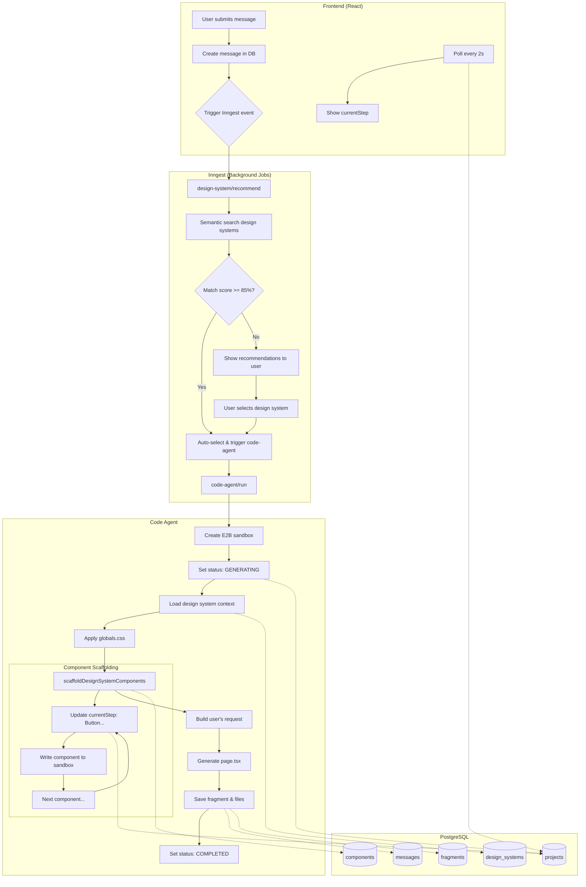
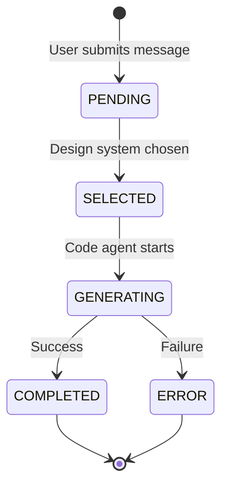

# Better Design

An [MCP server](https://modelcontextprotocol.io) that turns your Cursor, Claude Code, or claude.ai into a design engineer. Works in two parts:

1. **Scaffold** — Helps you discover and adopt a complete design system with the right tokens, shadows, and animations so the output looks like it was made by a product designer, not AI.

2. **Design Intelligence** — Like [Context7](https://context7.com) does for library docs, it feeds the right amount of UI/UX principles (hierarchy, spacing, typography, depth, animation) depending on what you're building, plus a self-review checklist so every piece of UI follows principles a product designer would follow.

## How It Works

### Design Intelligence (always active)

Every time you build UI, the MCP automatically loads relevant design principles and reviews your output:

```
You: "Add a settings page with a form"

AI: loads "spacing" + "hierarchy" principles → writes code → self-reviews against
    WCAG accessibility rules + visual design checklist → fixes issues → presents code

Result: Proper visual hierarchy, consistent spacing, accessible form inputs, hover/focus states
```

### Scaffold (on-demand for new projects)

When starting a project, say **"use better-design"** and the MCP finds a matching design system:

```
You: "Build a dashboard for a fintech app. use better-design"

AI: resolves Stripe design system (87% match) → loads CSS tokens + components
    → finds matching icon library → scaffolds with design system tokens

Result: Indigo accents, premium shadows, fintech-appropriate typography, consistent tokens
```

## Available Design Systems

| System | Theme | Vibe | Best For |
|--------|-------|------|----------|
| **Linear** | Dark | Minimal, professional, purple accents | Developer tools, productivity apps |
| **Linear Quality** | Dark | Precision-crafted, multi-layer shadows | High-polish developer tools |
| **Supabase** | Dark | Technical, modern, green accents | Backend dashboards, dev portals |
| **Vercel** | Dark | Pure black, Geist font, minimal | Deployment, developer platforms |
| **Airbnb** | Light | Warm, friendly, coral primary | Marketplaces, consumer apps |
| **Notion** | Light | Minimal, flat blue, rgba shadow | Productivity, note-taking apps |
| **Stripe** | Light | Fintech, indigo accents, premium shadows | Payments, financial products |
| **Apple** | Light | Premium, SF Pro, pill buttons | Consumer apps, marketing sites |
| **Figma** | Light | Design tool, electric violet, purple glow | Design/creative tooling |
| **Light Marketplace** | Light | Charcoal buttons, flat cards, no shadows | E-commerce, listings |
| **Precision Light** | Light | Charcoal primary, precision layered shadows | B2B SaaS, enterprise |
| **Minimal Light** | Light | Black primary, no shadows, border-only cards | Clean utilities, productivity |
| **Dark Orange** | Dark | Brand orange, 10px radius, layered shadows | Modern SaaS, dashboards |
| **Vibrant Dark** | Dark | Vibrant blue, color-bloom shadows | Consumer apps, social |
| **Neutral Monochrome** | Dark | White on near-black, no color | Understated, data-heavy tools |
| **Cinematic Dark** | Dark | Ultra-dark, content-first media | Streaming, media platforms |
| **Editorial Dark** | Dark | Serif display, flat, content-first | Publishing, editorial |
| **Corporate Fintech** | Light | Blue accents, data-dense layouts | Banking, enterprise, fintech |

Each includes a full `globals.css` (CSS tokens) plus overriding shadcn component code.

## Architecture

```
┌─────────────────────────────────────────────────────────────────┐
│             Your AI (Cursor / Claude Code / claude.ai)          │
└─────────────────────────┬───────────────────────────────────────┘
                          │
                          ▼
┌─────────────────────────────────────────────────────────────────┐
│              MCP Server (packages/shared/src/mcp)               │
│                                                                 │
│  Design Intelligence (always active for UI work):               │
│  • get-ui-principle → load relevant design principles           │
│  • get-review-rules → accessibility + visual design checklist   │
│                                                                 │
│  Scaffold (on-demand, "use better-design"):                     │
│  • resolve-design-system → semantic search with embeddings      │
│  • get-design-system-docs → fetch tokens + component code       │
│  • resolve-icon-library → match icon set to design personality  │
│  • search-icons → find specific icons via Iconify               │
└─────────────────────────┬───────────────────────────────────────┘
                          │
              ┌───────────┴───────────┐
              ▼                       ▼
┌──────────────────────┐  ┌──────────────────────┐
│  Stdio Transport     │  │  Remote Transport    │
│  (Cursor, Claude     │  │  (/api/mcp)          │
│   Code — local)      │  │  (claude.ai — cloud) │
└──────────────────────┘  └──────────────────────┘
```

## Setup

### Prerequisites

- [Bun](https://bun.sh) (package manager — do not use npm/yarn/pnpm)
- A [Neon](https://neon.tech) Postgres database (free tier works)
- Gemini API key (for embeddings)

### 1. Clone and install

```bash
git clone https://github.com/your-username/better-design.git
cd better-design
bun install
```

### 2. Configure environment

```bash
cp packages/web/.env.example packages/web/.env
```

```env
DATABASE_URL=postgresql://...@...neon.tech/...?sslmode=require
GEMINI_API_KEY=your-gemini-key
```

### 3. Push the database schema

```bash
cd packages/web && bun db:push
```

### 4. Run the dev server

```bash
bun dev
```

### 5. (Optional) Connect the stdio MCP to Claude Desktop

```bash
cd packages/mcp && bun run build
```

Add to `~/Library/Application Support/Claude/claude_desktop_config.json`:

```json
{
  "mcpServers": {
    "design-systems": {
      "command": "node",
      "args": ["/absolute/path/to/packages/mcp/dist/index.js"]
    }
  }
}
```

Restart Claude Desktop. You're ready to go.

> **Remote MCP:** The web app also exposes a remote MCP endpoint at `/api/mcp` — no local setup required. Connect any MCP-compatible AI tool directly with an API key from `/settings`.

## Usage

Once connected, your AI assistant can:

1. **Search** — "Find a design system for a developer tools startup"
2. **Get details** — "Show me the Column design system's color palette"
3. **Install** — The AI runs `npx shadcn add [component] --registry [url]`

## Web App Architecture

The web app (`packages/web`) provides an interactive UI for generating styled components. Here's the full workflow:



### Key Components

| Component | Purpose |
|-----------|---------|
| `inngest/functions.ts` | Background job definitions (code-agent, design-system-recommender) |
| `lib/design-systems/` | Design system search & formatting |
| `lib/foundational-docs/` | UI guidance search (animations, spacing, colors, etc.) |
| `prompt.ts` | AI agent system prompt |
| `modules/projects/` | Frontend project views & components |

### UI Design Guidance Flow

The code agent discovers relevant design guidelines via semantic search—no hardcoded rules:

```
┌─────────────────────────────────────────────────────────────────────┐
│  User: "Build a modal with smooth open/close animations"           │
└─────────────────────────────────────────────────────────────────────┘
                                    │
                                    ▼
┌─────────────────────────────────────────────────────────────────────┐
│  Agent analyzes task → identifies: "modal + animation"              │
│                                                                     │
│  Calls: getUIGuidance({ topic: "modal animation interruptible" })   │
└─────────────────────────────────────────────────────────────────────┘
                                    │
                                    ▼
┌─────────────────────────────────────────────────────────────────────┐
│  Semantic Search (pgvector)                                         │
│                                                                     │
│  Searches ALL foundational_docs by embedding similarity:            │
│  ├── animation-patterns.md → Interruptible animations with Motion  │
│  ├── animation.md → Easing curves, duration, springs               │
│  ├── depth.md → Shadows, layering                                  │
│  └── ... other relevant docs                                       │
└─────────────────────────────────────────────────────────────────────┘
                                    │
                                    ▼
┌─────────────────────────────────────────────────────────────────────┐
│  Returns top matches with scores:                                   │
│                                                                     │
│  1. Animation Patterns (92% match)                                  │
│     → Make animations interruptible with Motion's delay()           │
│     → Cancel pending animations on close                            │
│                                                                     │
│  2. Animation Guidelines (88% match)                                │
│     → Use spring animations, 200-300ms duration                     │
│     → ease-out for entering, ease-in-out for movement               │
└─────────────────────────────────────────────────────────────────────┘
                                    │
                                    ▼
┌─────────────────────────────────────────────────────────────────────┐
│  Agent builds modal WITH:                                           │
│  ✓ delay() from motion with cancelDelayRef                          │
│  ✓ Interruptible open/close states                                  │
│  ✓ Spring transitions (stiffness: 400, damping: 25)                 │
└─────────────────────────────────────────────────────────────────────┘
```

**Adding new guidelines:**
1. Create a markdown file in `docs/` (e.g., `docs/accessibility.md`)
2. Add it to `packages/mcp/src/lib/seed.ts`:
   ```ts
   { file: "accessibility.md", id: "accessibility", title: "Accessibility Guidelines" }
   ```
3. Run `bun run seed` in `packages/mcp`

The agent discovers new guidelines automatically via semantic search—no prompt changes needed.

### Component Catalog Pattern

The catalog pattern ensures the AI generates **complete, production-ready design systems** with all required components:

```
┌─────────────────────────────────────────────────────────────────────┐
│  Code Agent receives user request                                   │
│  "Build a Linear-style dashboard"                                   │
└─────────────────────────────────────────────────────────────────────┘
                                    │
                                    ▼
┌─────────────────────────────────────────────────────────────────────┐
│  System Prompt includes Component Catalog                           │
│                                                                     │
│  📋 77 Required shadcn Components:                                  │
│  ├── Layout: Accordion, Card, Collapsible, ScrollArea...           │
│  ├── Navigation: Breadcrumb, Tabs, Pagination...                   │
│  ├── Forms: Button, Input, Select, Checkbox...                     │
│  ├── Data Display: Avatar, Badge, Table, Chart...                  │
│  ├── Feedback: Alert, Toast, Dialog...                             │
│  └── Overlays: Modal, Drawer, Tooltip...                           │
│                                                                     │
│  ✨ Custom Component Templates:                                     │
│  ├── Voice (Card + Animation)                                       │
│  ├── BentoGrid (Grid + Cards)                                      │
│  ├── MetricCard (Card + Typography + Icon)                         │
│  └── ... based on user's use case                                  │
└─────────────────────────────────────────────────────────────────────┘
                                    │
                                    ▼
┌─────────────────────────────────────────────────────────────────────┐
│  AI generates Storybook-like documentation site with 3 sections:    │
│                                                                     │
│  app/                                                               │
│  ├── layout.tsx              # Root layout with sidebar             │
│  ├── page.tsx                # Homepage/introduction                │
│  ├── components/                                                    │
│  │   ├── sidebar.tsx         # Three-section navigation             │
│  │   └── code-block.tsx      # Code display with copy               │
│  │                                                                  │
│  ├── foundations/            # Section 1: Basic elements            │
│  │   ├── colors/page.tsx     # Color palette showcase              │
│  │   ├── surfaces/page.tsx   # Shadows, borders, depth             │
│  │   └── typography/page.tsx # Font scales, weights                │
│  │                                                                  │
│  ├── primitives/             # Section 2: All 77 shadcn components │
│  │   ├── accordion/page.tsx                                         │
│  │   ├── alert/page.tsx                                             │
│  │   ├── button/page.tsx                                            │
│  │   └── ... (77 component pages)                                  │
│  │                                                                  │
│  └── custom/                 # Section 3: Icons + custom components│
│      ├── icons/page.tsx      # Icon library showcase (required)    │
│      ├── metric-card/page.tsx                                       │
│      └── dashboard-grid/page.tsx                                    │
└─────────────────────────────────────────────────────────────────────┘
                                    │
                                    ▼
┌─────────────────────────────────────────────────────────────────────┐
│  Validation Step (packages/web/src/lib/validate-design-system.ts)   │
│                                                                     │
│  ✓ Documentation site structure complete                           │
│  ✓ All 77 primitive component pages generated                      │
│  ✓ All 3 foundation pages present                                  │
│  ✓ Icons page exists (required)                                    │
│  ✓ Identify custom components created                              │
│                                                                     │
│  Console Output:                                                    │
│  Generated 82 component pages:                                      │
│  - 77 primitive components                                          │
│  - 5 custom components (including icons)                            │
│                                                                     │
│  ✓ Custom component pages:                                          │
│    - icons (icon library showcase)                                  │
│    - metric-card                                                    │
│    - dashboard-grid                                                 │
│    - status-badge                                                   │
│    - activity-feed                                                  │
└─────────────────────────────────────────────────────────────────────┘
                                    │
                                    ▼
┌─────────────────────────────────────────────────────────────────────┐
│  User browses complete design system in iframe with sidebar nav:    │
│                                                                     │
│  ┌──────────────────┬──────────────────────────────────────────┐   │
│  │ 🏠 Home          │  Welcome to Linear Design System        │   │
│  │                  │  ──────────────────────────────────────  │   │
│  │ Foundations      │  A dark, minimal design system for      │   │
│  │ › Colors         │  developer tools and productivity apps  │   │
│  │ › Surfaces       │                                          │   │
│  │ › Typography     │  Sections:                               │   │
│  │                  │  1. Foundations - Colors, surfaces, type │   │
│  │ Primitives       │  2. Primitives - 77 shadcn components    │   │
│  │ › Layout (8)     │  3. Custom - Icons + custom components   │   │
│  │   · Accordion    │  ──────────────────────────────────────  │   │
│  │   · Card         │  [Button Example] [Card Example]        │   │
│  │   · Sidebar      │                                          │   │
│  │ › Navigation (5) │                                          │   │
│  │   · Tabs         │                                          │   │
│  │   · Breadcrumb   │                                          │   │
│  │ › Forms (19)     │                                          │   │
│  │   · Button       │                                          │   │
│  │   · Input        │                                          │   │
│  │   · Select       │                                          │   │
│  │ › ... (5 more)   │                                          │   │
│  │                  │                                          │   │
│  │ Custom           │                                          │   │
│  │ › Icons          │                                          │   │
│  │ › MetricCard     │                                          │   │
│  └──────────────────┴──────────────────────────────────────────┘   │
└─────────────────────────────────────────────────────────────────────┘
```

**Key Benefits:**
- **Completeness:** All 77 shadcn components generated every time
- **Browsable Interface:** Storybook-like sidebar navigation
- **Live Examples:** Each component page shows variants and code
- **Custom Components:** AI creates domain-specific components by remixing base components
- **Validation:** Automatically checks for missing components

**Implementation Files:**
- `packages/web/src/lib/catalogs/shadcn-catalog.ts` - Complete catalog of 77 components
- `packages/web/src/lib/validate-design-system.ts` - Validation utilities
- `packages/web/src/prompt.ts` - System prompt with catalog
- `packages/web/src/inngest/functions.ts` - Validation integration

### Generated Design System Roadmap

The documentation site is structured in three main sections that will expand over time:

```
┌─────────────────────────────────────────────────────────────────────┐
│                   Design System Documentation                       │
└─────────────────────────────────────────────────────────────────────┘

    ┌───────────────────────────────────────────────────────────────┐
    │ 1️⃣  FOUNDATIONS (Current - V1)                                 │
    │    Basic design system elements                               │
    ├───────────────────────────────────────────────────────────────┤
    │    ✅ Colors         - Palette, tokens, semantic colors       │
    │    ✅ Surfaces       - Shadows, borders, elevation            │
    │    ✅ Typography     - Font scales, weights, line heights     │
    └───────────────────────────────────────────────────────────────┘

    ┌───────────────────────────────────────────────────────────────┐
    │ 2️⃣  PRIMITIVES (Current - V1)                                  │
    │    All 77 production-ready shadcn components                  │
    │    Organized by category with collapsible sections:           │
    ├───────────────────────────────────────────────────────────────┤
    │    ✅ Layout & Structure (8)                                   │
    │       Accordion, Card, Sidebar, ScrollArea, Collapsible...    │
    │                                                               │
    │    ✅ Navigation (5)                                           │
    │       Tabs, Breadcrumb, Pagination, NavigationMenu...         │
    │                                                               │
    │    ✅ Forms & Inputs (19)                                      │
    │       Button, Input, Select, Checkbox, Calendar...            │
    │                                                               │
    │    ✅ Data Display (13)                                        │
    │       Avatar, Badge, Table, Chart, DataTable...               │
    │                                                               │
    │    ✅ Feedback (4)                                             │
    │       Alert, Toast, Dialog, AlertDialog                       │
    │                                                               │
    │    ✅ Overlays (6)                                             │
    │       Modal, Drawer, Tooltip, Popover, Sheet...               │
    │                                                               │
    │    ✅ Menus (3)                                                │
    │       Command, ContextMenu, DropdownMenu                      │
    │                                                               │
    │    ✅ Toggle (2)                                               │
    │       Toggle, ToggleGroup                                     │
    │                                                               │
    │    Each component page shows:                                 │
    │    • Live examples with all variants                          │
    │    • Copyable code snippets                                   │
    │    • Props documentation                                      │
    └───────────────────────────────────────────────────────────────┘

    ┌───────────────────────────────────────────────────────────────┐
    │ 3️⃣  CUSTOM (Expanding)                                         │
    │    Use case specific assets and components                    │
    ├───────────────────────────────────────────────────────────────┤
    │    ✅ Icons (V1 - Current)                                     │
    │       • Icon library showcase with search                     │
    │       • Copy icon names to clipboard                          │
    │       • Usage examples with Iconify React                     │
    │                                                               │
    │    ✅ TSX Components (V1 - Current)                            │
    │       • MetricCard - Dashboard cards with stats               │
    │       • ListingCard - Marketplace product cards               │
    │       • BentoGrid - Feature showcase grids                    │
    │       • Custom components based on use case                   │
    │                                                               │
    │    🔮 Images (V2 - Future)                                     │
    │       • Design system imagery                                 │
    │       • Brand assets and illustrations                        │
    │       • Icon sets and graphics                                │
    │       • Placeholder images with proper ratios                 │
    │                                                               │
    │    🔮 Videos (V3 - Future)                                     │
    │       • Motion design examples                                │
    │       • Component usage demos                                 │
    │       • Animation references                                  │
    │       • Background videos and media                           │
    └───────────────────────────────────────────────────────────────┘
```

**Current Focus (V1):** TSX components only - Foundations, Primitives, and Custom TSX components + Icons

**Future Roadmap:**
- **V2:** Add image asset management to Custom section
- **V3:** Add video asset support to Custom section

The three-section structure makes it easy to expand capabilities while maintaining a clean, organized documentation site.

### Status Flow



## Project Structure

```
better-design/
├── design-systems/          # Source of truth for each design system
│   ├── linear/
│   │   ├── globals.css      # CSS variables (colors, spacing, radius)
│   │   ├── components/      # Component TSX overrides
│   │   └── utils.ts         # cn() helper
│   ├── supabase/
│   ├── airbnb/
│   └── ...                  # 18 systems total
├── docs/                    # Design foundations (colors, animation, principles)
├── packages/
│   ├── shared/              # Shared MCP server definition (tools, instructions, types)
│   │   └── src/mcp/         # createMcpServer() + DataProvider interface
│   ├── mcp/                 # Stdio transport (Cursor, Claude Code)
│   └── web/                 # Next.js app + remote MCP transport (claude.ai)
│       └── src/
│           ├── app/         # App Router pages
│           ├── db/schema.ts # Drizzle schema
│           ├── inngest/     # Background job functions
│           ├── lib/         # Design system search, catalogs, validation
│           └── server/api/  # Hono routes (/api/v1, /api/mcp, /api/projects...)
└── README.md
```

## Adding a Design System

1. Create a folder in `design-systems/`:
   ```
   design-systems/my-system/
   ├── globals.css      # CSS variables
   ├── components/      # TSX component files
   └── utils.ts         # cn() helper
   ```

2. Add metadata in `packages/mcp/src/lib/seed.ts`

3. Seed:
   ```bash
   cd packages/mcp && npm run seed
   ```

## Why Keep Full Component Code?

Design nuances live in the components, not just CSS variables:

- Shadow layers (Linear's subtle stacked shadows)
- Focus states (ring vs glow vs color shift)
- Border thickness per component type
- Hover/active transitions
- Radius variations by context

CSS variables alone can't capture these details.

## License

MIT
