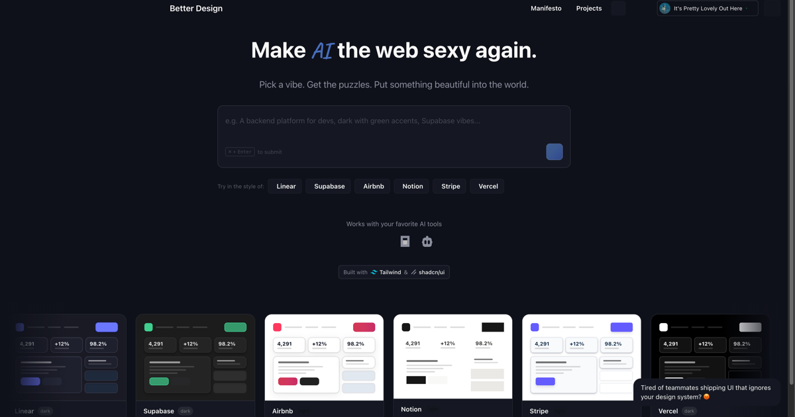
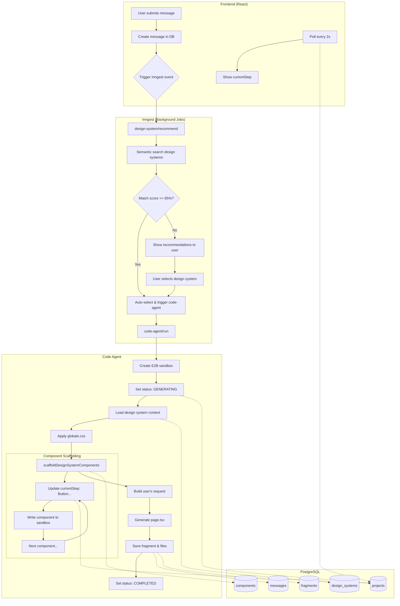
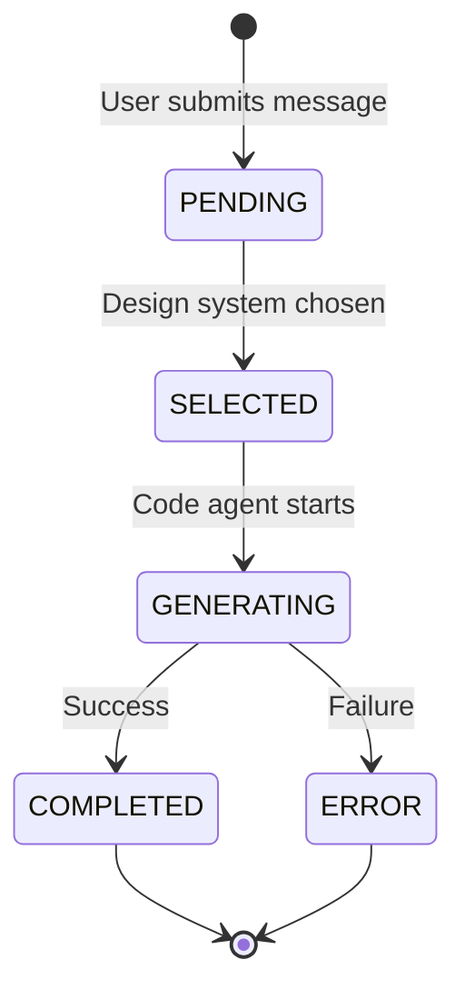

# Better Design: Open source Claude Design

> **Turn your AI coding IDE into a design engineer.** Better Design works with MCP-compatible agents and editors like Claude Code, Cursor, VS Code/GitHub Copilot, Claude Desktop, and claude.ai. It is a design MCP server, AI design-system registry, and UI review layer for generating polished product interfaces from prompts.



[Website](https://better-design.com) · [MCP server](packages/mcp) · [Design systems](#available-design-systems) · [Setup](#setup) · [Architecture](#architecture)


## What is Better Design?

Better Design gives AI coding agents the design context they usually miss: design tokens, component code, UI principles, icon direction, accessibility checks, and visual-design review rules.

Think of it as a **Claude Design-style workflow for your own codebase**:

1. Pick the product direction: Linear, Supabase, Vercel, Airbnb, Stripe, Apple, Notion, Figma, or another curated design system.
2. Feed your AI agent the right `globals.css`, semantic tokens, component overrides, icon set, spacing, typography, shadows, radius, and motion language.
3. Ask Claude Code, Cursor, VS Code/GitHub Copilot, Claude Desktop, claude.ai, or another MCP-compatible coding agent to build the interface.
4. Have the MCP review the output against accessibility and design principles before you ship it.

Instead of “AI-looking UI,” you get interfaces that look like they were built from a real product design system.

## Why Better Design?

- **Claude Design-style workflow, open MCP.** Bring the artifact-first design loop people expect from Claude Design into Claude Code, Cursor, VS Code/GitHub Copilot, Claude Desktop, claude.ai, and any MCP-compatible client.
- **Design systems, not vague vibes.** Each system includes semantic CSS tokens plus production component code, so generated UI uses real implementation details instead of guessed colors.
- **AI UI generation with guardrails.** The MCP can load principles for hierarchy, spacing, typography, depth, motion, forms, and accessibility exactly when the agent needs them.
- **Self-review before handoff.** `get-review-rules` gives your agent a WCAG and visual-design checklist so it can catch missing focus states, weak hierarchy, bad contrast, and inconsistent spacing.
- **Built for AI coding workflows.** Better Design speaks the language agents already use to build modern product UI: tokens, components, accessibility, hierarchy, spacing, and motion.

## How it works

Better Design has two layers: an always-on **Design Intelligence** layer and an on-demand **Scaffold** layer.

### 1. Design Intelligence — always active for UI work

When your agent builds UI, Better Design can load the relevant product-design principles and review rules:

```text
You: "Add a settings page with a form"

AI: calls get-ui-principle("spacing") + get-ui-principle("hierarchy")
    → writes the page
    → calls get-review-rules("accessibility") + get-review-rules("visual-design")
    → fixes contrast, labels, focus states, spacing, and hierarchy

Result: A settings page with accessible inputs, clear grouping, visible states, and consistent rhythm.
```

### 2. Scaffold — design-system matching for new UI

When starting a product, page, or component set, say **"use better-design"** and the MCP finds a matching design system:

```text
You: "Build a fintech dashboard in the style of Stripe. use better-design"

AI: calls resolve-design-system("fintech dashboard, Stripe")
    → loads design-system docs, CSS tokens, and component code
    → resolves a matching icon library
    → builds with semantic tokens instead of raw colors

Result: Indigo accents, premium shadows, fintech typography, consistent cards, inputs, buttons, and charts.
```

## What the MCP gives your agent

| Tool | What it does | Why it matters |
|------|--------------|----------------|
| `resolve-design-system` | Semantically matches the right design system for a prompt | Stops agents from guessing a visual direction |
| `get-design-system-docs` | Loads tokens, components, usage notes, and install context | Gives the agent implementation-ready design context |
| `get-ui-principle` | Fetches focused guidance for hierarchy, spacing, typography, depth, motion, forms, and more | Makes UI decisions principled instead of random |
| `get-review-rules` | Returns accessibility and visual-design review checklists | Helps the agent critique and fix its own output |
| `resolve-icon-library` | Picks an icon family that matches the design personality | Keeps icon style consistent with the UI |
| `search-icons` | Finds specific icons through Iconify | Speeds up implementation without mixing icon styles |

## Available Design Systems

Better Design ships with curated design systems for common product categories: developer tools, fintech dashboards, marketplaces, productivity apps, consumer apps, media products, and enterprise software.

| System | Theme | Vibe | Best For |
|--------|-------|------|----------|
| **Linear** | Dark | Minimal, professional, purple accents | Developer tools, productivity apps |
| **Linear Quality** | Dark | Precision-crafted, multi-layer shadows | High-polish developer tools |
| **Supabase** | Dark | Technical, modern, green accents | Backend dashboards, dev portals |
| **Vercel** | Dark | Pure black, Geist font, minimal | Deployment, developer platforms |
| **Airbnb** | Light | Warm, friendly, coral primary | Marketplaces, consumer apps |
| **Notion** | Light | Minimal, flat blue, rgba shadow | Productivity, note-taking apps |
| **Stripe** | Light | Fintech, indigo accents, premium shadows | Payments, financial products |
| **Apple** | Light | Premium, SF Pro, pill buttons | Consumer apps, marketing sites |
| **Figma** | Light | Design tool, electric violet, purple glow | Design/creative tooling |
| **Light Marketplace** | Light | Charcoal buttons, flat cards, no shadows | E-commerce, listings |
| **Precision Light** | Light | Charcoal primary, precision layered shadows | B2B SaaS, enterprise |
| **Minimal Light** | Light | Black primary, no shadows, border-only cards | Clean utilities, productivity |
| **Dark Orange** | Dark | Brand orange, 10px radius, layered shadows | Modern SaaS, dashboards |
| **Vibrant Dark** | Dark | Vibrant blue, color-bloom shadows | Consumer apps, social |
| **Neutral Monochrome** | Dark | White on near-black, no color | Understated, data-heavy tools |
| **Cinematic Dark** | Dark | Ultra-dark, content-first media | Streaming, media platforms |
| **Editorial Dark** | Dark | Serif display, flat, content-first | Publishing, editorial |
| **Corporate Fintech** | Light | Blue accents, data-dense layouts | Banking, enterprise, fintech |

Each design system includes a full `globals.css` token layer plus overriding component code.

## Architecture

```text
┌─────────────────────────────────────────────────────────────────┐
│  Your AI agent or IDE: Claude Code / Cursor / GitHub Copilot    │
└─────────────────────────┬───────────────────────────────────────┘
                          │
                          ▼
┌─────────────────────────────────────────────────────────────────┐
│              MCP Server (packages/shared/src/mcp)               │
│                                                                 │
│  Design Intelligence, always active for UI work:                │
│  • get-ui-principle → load relevant design principles           │
│  • get-review-rules → accessibility + visual design checklist   │
│                                                                 │
│  Scaffold, on demand with "use better-design":                  │
│  • resolve-design-system → semantic search with embeddings      │
│  • get-design-system-docs → fetch tokens + component code       │
│  • resolve-icon-library → match icon set to design personality  │
│  • search-icons → find specific icons via Iconify               │
└─────────────────────────┬───────────────────────────────────────┘
                          │
              ┌───────────┴───────────┐
              ▼                       ▼
┌──────────────────────┐  ┌──────────────────────┐
│  Stdio Transport     │  │  Remote Transport    │
│  Claude Desktop,     │  │  /api/mcp            │
│  Claude Code, Cursor,│  │  claude.ai, cloud    │
│  VS Code/Copilot     │  │                      │
└──────────────────────┘  └──────────────────────┘
```

## Setup

### Prerequisites

- [Bun](https://bun.sh) for local development
- A [Neon](https://neon.tech) Postgres database (free tier works)
- Gemini API key for design-system embeddings

### 1. Clone and install

```bash
git clone https://github.com/marvkr/better-design.git
cd better-design
bun install
```

### 2. Configure environment

```bash
cp packages/web/.env.example packages/web/.env
```

```env
DATABASE_URL=postgresql://...@...neon.tech/...?sslmode=require
GEMINI_API_KEY=your-gemini-key
```

### 3. Push the database schema

```bash
cd packages/web && bun db:push
```

### 4. Run the dev server

```bash
bun dev
```

### 5. Optional: connect the stdio MCP to Claude Desktop

```bash
cd packages/mcp && bun run build
```

Add the local MCP server to `~/Library/Application Support/Claude/claude_desktop_config.json`:

```json
{
  "mcpServers": {
    "better-design": {
      "command": "node",
      "args": ["/absolute/path/to/better-design/packages/mcp/dist/index.js"]
    }
  }
}
```

Restart Claude Desktop. You can now ask Claude to use Better Design while building UI.

> **Remote MCP:** The web app also exposes a remote MCP endpoint at `/api/mcp`. Connect any MCP-compatible AI tool or coding IDE with an API key from `/settings` when you do not want local stdio setup.

## Usage examples

Once connected, ask your agent for design help directly:

```text
"Use better-design. Build a Linear-style project settings page with billing, team members, and API keys."
```

```text
"Find a design system for a developer tools startup, then build the dashboard with matching components."
```

```text
"Review this form with Better Design's accessibility and visual-design rules, then fix the issues."
```

Your AI assistant can search design systems, load implementation details, choose matching icons, scaffold components, and self-review generated UI before presenting the final code.

## Web App Architecture

The web app (`packages/web`) provides an interactive UI for generating styled components. Here's the full workflow:



### Key Components

| Component | Purpose |
|-----------|---------|
| `inngest/functions.ts` | Background job definitions (code-agent, design-system-recommender) |
| `lib/design-systems/` | Design system search & formatting |
| `lib/foundational-docs/` | UI guidance search (animations, spacing, colors, etc.) |
| `prompt.ts` | AI agent system prompt |
| `modules/projects/` | Frontend project views & components |

### UI Design Guidance Flow

The code agent discovers relevant design guidelines via semantic search—no hardcoded rules:

```
┌─────────────────────────────────────────────────────────────────────┐
│  User: "Build a modal with smooth open/close animations"           │
└─────────────────────────────────────────────────────────────────────┘
                                    │
                                    ▼
┌─────────────────────────────────────────────────────────────────────┐
│  Agent analyzes task → identifies: "modal + animation"              │
│                                                                     │
│  Calls: getUIGuidance({ topic: "modal animation interruptible" })   │
└─────────────────────────────────────────────────────────────────────┘
                                    │
                                    ▼
┌─────────────────────────────────────────────────────────────────────┐
│  Semantic Search (pgvector)                                         │
│                                                                     │
│  Searches ALL foundational_docs by embedding similarity:            │
│  ├── animation-patterns.md → Interruptible animations with Motion  │
│  ├── animation.md → Easing curves, duration, springs               │
│  ├── depth.md → Shadows, layering                                  │
│  └── ... other relevant docs                                       │
└─────────────────────────────────────────────────────────────────────┘
                                    │
                                    ▼
┌─────────────────────────────────────────────────────────────────────┐
│  Returns top matches with scores:                                   │
│                                                                     │
│  1. Animation Patterns (92% match)                                  │
│     → Make animations interruptible with Motion's delay()           │
│     → Cancel pending animations on close                            │
│                                                                     │
│  2. Animation Guidelines (88% match)                                │
│     → Use spring animations, 200-300ms duration                     │
│     → ease-out for entering, ease-in-out for movement               │
└─────────────────────────────────────────────────────────────────────┘
                                    │
                                    ▼
┌─────────────────────────────────────────────────────────────────────┐
│  Agent builds modal WITH:                                           │
│  ✓ delay() from motion with cancelDelayRef                          │
│  ✓ Interruptible open/close states                                  │
│  ✓ Spring transitions (stiffness: 400, damping: 25)                 │
└─────────────────────────────────────────────────────────────────────┘
```

**Adding new guidelines:**
1. Create a markdown file in `docs/` (e.g., `docs/accessibility.md`)
2. Add it to `packages/mcp/src/lib/seed.ts`:
   ```ts
   { file: "accessibility.md", id: "accessibility", title: "Accessibility Guidelines" }
   ```
3. Run `bun run seed` in `packages/mcp`

The agent discovers new guidelines automatically via semantic search—no prompt changes needed.

### Component Catalog Pattern

The catalog pattern ensures the AI generates **complete, production-ready design systems** with all required components:

```
┌─────────────────────────────────────────────────────────────────────┐
│  Code Agent receives user request                                   │
│  "Build a Linear-style dashboard"                                   │
└─────────────────────────────────────────────────────────────────────┘
                                    │
                                    ▼
┌─────────────────────────────────────────────────────────────────────┐
│  System Prompt includes Component Catalog                           │
│                                                                     │
│  📋 77 Required shadcn Components:                                  │
│  ├── Layout: Accordion, Card, Collapsible, ScrollArea...           │
│  ├── Navigation: Breadcrumb, Tabs, Pagination...                   │
│  ├── Forms: Button, Input, Select, Checkbox...                     │
│  ├── Data Display: Avatar, Badge, Table, Chart...                  │
│  ├── Feedback: Alert, Toast, Dialog...                             │
│  └── Overlays: Modal, Drawer, Tooltip...                           │
│                                                                     │
│  ✨ Custom Component Templates:                                     │
│  ├── Voice (Card + Animation)                                       │
│  ├── BentoGrid (Grid + Cards)                                      │
│  ├── MetricCard (Card + Typography + Icon)                         │
│  └── ... based on user's use case                                  │
└─────────────────────────────────────────────────────────────────────┘
                                    │
                                    ▼
┌─────────────────────────────────────────────────────────────────────┐
│  AI generates Storybook-like documentation site with 3 sections:    │
│                                                                     │
│  app/                                                               │
│  ├── layout.tsx              # Root layout with sidebar             │
│  ├── page.tsx                # Homepage/introduction                │
│  ├── components/                                                    │
│  │   ├── sidebar.tsx         # Three-section navigation             │
│  │   └── code-block.tsx      # Code display with copy               │
│  │                                                                  │
│  ├── foundations/            # Section 1: Basic elements            │
│  │   ├── colors/page.tsx     # Color palette showcase              │
│  │   ├── surfaces/page.tsx   # Shadows, borders, depth             │
│  │   └── typography/page.tsx # Font scales, weights                │
│  │                                                                  │
│  ├── primitives/             # Section 2: All 77 shadcn components │
│  │   ├── accordion/page.tsx                                         │
│  │   ├── alert/page.tsx                                             │
│  │   ├── button/page.tsx                                            │
│  │   └── ... (77 component pages)                                  │
│  │                                                                  │
│  └── custom/                 # Section 3: Icons + custom components│
│      ├── icons/page.tsx      # Icon library showcase (required)    │
│      ├── metric-card/page.tsx                                       │
│      └── dashboard-grid/page.tsx                                    │
└─────────────────────────────────────────────────────────────────────┘
                                    │
                                    ▼
┌─────────────────────────────────────────────────────────────────────┐
│  Validation Step (packages/web/src/lib/validate-design-system.ts)   │
│                                                                     │
│  ✓ Documentation site structure complete                           │
│  ✓ All 77 primitive component pages generated                      │
│  ✓ All 3 foundation pages present                                  │
│  ✓ Icons page exists (required)                                    │
│  ✓ Identify custom components created                              │
│                                                                     │
│  Console Output:                                                    │
│  Generated 82 component pages:                                      │
│  - 77 primitive components                                          │
│  - 5 custom components (including icons)                            │
│                                                                     │
│  ✓ Custom component pages:                                          │
│    - icons (icon library showcase)                                  │
│    - metric-card                                                    │
│    - dashboard-grid                                                 │
└─────────────────────────────────────────────────────────────────────┘
```

**Key Benefits:**
- **Completeness:** All 77 shadcn components generated every time
- **Browsable Interface:** Storybook-like sidebar navigation
- **Live Examples:** Each component page shows variants and code
- **Custom Components:** AI creates domain-specific components by remixing base components
- **Validation:** Automatically checks for missing components

**Implementation Files:**
- `packages/web/src/lib/catalogs/shadcn-catalog.ts` - Complete catalog of 77 components
- `packages/web/src/lib/validate-design-system.ts` - Validation utilities
- `packages/web/src/prompt.ts` - System prompt with catalog
- `packages/web/src/inngest/functions.ts` - Validation integration

### Status Flow



## Project Structure

```
better-design/
├── design-systems/          # Source of truth for each design system
│   ├── linear/
│   │   ├── globals.css      # CSS variables (colors, spacing, radius)
│   │   ├── components/      # Component TSX overrides
│   │   └── utils.ts         # cn() helper
│   ├── supabase/
│   ├── airbnb/
│   └── ...                  # 18 systems total
├── docs/                    # Design foundations (colors, animation, principles)
├── packages/
│   ├── shared/              # Shared MCP server definition (tools, instructions, types)
│   │   └── src/mcp/         # createMcpServer() + DataProvider interface
│   ├── mcp/                 # Stdio transport (Cursor, Claude Code)
│   └── web/                 # Next.js app + remote MCP transport (claude.ai)
│       └── src/
│           ├── app/         # App Router pages
│           ├── db/schema.ts # Drizzle schema
│           ├── inngest/     # Background job functions
│           ├── lib/         # Design system search, catalogs, validation
│           └── server/api/  # Hono routes (/api/v1, /api/mcp, /api/projects...)
└── README.md
```

## Adding a Design System

1. Create a folder in `design-systems/`:
   ```
   design-systems/my-system/
   ├── globals.css      # CSS variables
   ├── components/      # TSX component files
   └── utils.ts         # cn() helper
   ```

2. Add metadata in `packages/mcp/src/lib/seed.ts`

3. Seed:
   ```bash
   cd packages/mcp && npm run seed
   ```

## Why Keep Full Component Code?

Design nuances live in the components, not just CSS variables:

- Shadow layers (Linear's subtle stacked shadows)
- Focus states (ring vs glow vs color shift)
- Border thickness per component type
- Hover/active transitions
- Radius variations by context

CSS variables alone can't capture these details.

## License

MIT
